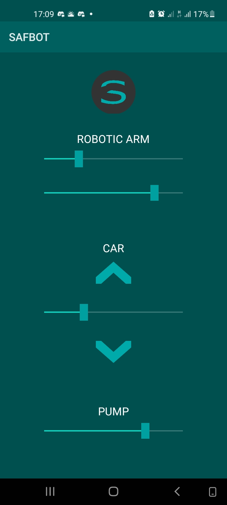
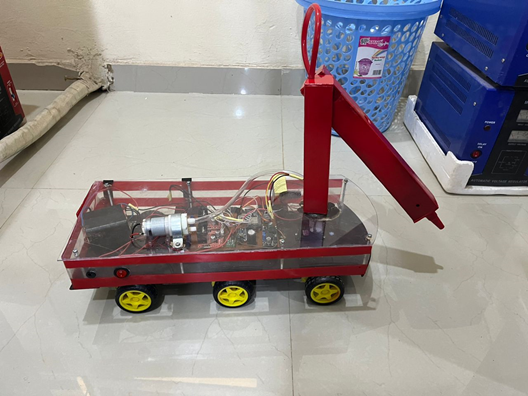

### 🤖 SAFBOT
A compact vehicle with a water pump that can be remotely controlled via a mobile Android app.

- **Key Features**:
  - Remote Vehicle Control: Users can move the vehicle in any direction and adjust its speed via the Android app.
  - Pump Operation: The app allows for the control of the water pump, enabling users to manage the intensity of the firefighting operation.
  - Robotic Arm Manipulation: The arm can be precisely controlled, allowing for accurate targeting of the water spray, including the ability to rotate and extend the arm.

- **Technology Stack**
  - ESP32 Microcontroller: Manages the hardware components and Wi-Fi communication.
  - Java (Android App): Provides the interface and logic for user interaction, communicating with the ESP32 via the Volley library.
  - Servo Motors: Used in the robotic arm for accurate movement.
  - Wi-Fi: Facilitates communication between the Android app and the ESP32 microcontroller.

  
  

[Watch the video](robot_car.mp4)

